<div align="center">
  
</div>

<div align="center">
  
</div>

<div align="center">
  
  
  
</div>

---

## ✨ About Me


```css
.designer {
  name: "Thathsarani venura thnasuriya";
  role: "UI/UX Designer";
  location: "Sri Lanka 🇱🇰";
  passion: "Creating meaningful user experiences";
  
  skills: [
    "User Interface Design",
    "User Experience Research", 
    "Prototyping & Wireframing",
    "Design Systems",
    "Visual Design"
  ];
  
  tools: [
    "Figma", "Adobe XD", "Sketch",
    "Photoshop", "Illustrator", "After Effects"
  ];
  
  code: ["HTML", "CSS", "JavaScript"];
  
  motto: "Design is not just what it looks like - 
         design is how it works! 💫";
}
```

<br clear="right"/>

## 🎯 What I Do

<table>
<tr>
<td width="33%" align="center">

<h3>🎨 UI Design</h3>
<p>Creating beautiful, intuitive interfaces that users love to interact with</p>
</td>
<td width="33%" align="center">

<h3>🔍 UX Research</h3>
<p>Understanding user needs through research, testing, and data analysis</p>
</td>
<td width="33%" align="center">

<h3>⚡ Prototyping</h3>
<p>Bringing ideas to life with interactive prototypes and user flows</p>
</td>
</tr>
</table>

## 🛠️ Design Arsenal

<div align="center">

### 🎨 Design Tools
<table>
<tr>
<td align="center" width="120">

<br><strong>Figma</strong>
</td>
<td align="center" width="120">

<br><strong>Adobe XD</strong>
</td>
<td align="center" width="120">

<br><strong>Sketch</strong>
</td>
<td align="center" width="120">

<br><strong>Photoshop</strong>
</td>
<td align="center" width="120">

<br><strong>Illustrator</strong>
</td>
</tr>
</table>

### 💻 Development Skills
<table>
<tr>
<td align="center" width="120">

<br><strong>HTML5</strong>
</td>
<td align="center" width="120">

<br><strong>CSS3</strong>
</td>
<td align="center" width="120">

<br><strong>JavaScript</strong>
</td>
<td align="center" width="120">

<br><strong>React</strong>
</td>
<td align="center" width="120">

<br><strong>Sass</strong>
</td>
</tr>
</table>

### 🔧 Other Tools
<table>
<tr>
<td align="center" width="120">

<br><strong>After Effects</strong>
</td>
<td align="center" width="120">

<br><strong>Premiere Pro</strong>
</td>
<td align="center" width="120">

<br><strong>Canva</strong>
</td>
<td align="center" width="120">

<br><strong>Git</strong>
</td>
<td align="center" width="120">

<br><strong>VS Code</strong>
</td>
</tr>
</table>

</div>

## 🌈 Design Process

```mermaid
graph LR
    A[🔍 Research] --> B[💡 Ideation]
    B --> C[✏️ Sketching]
    C --> D[🎨 Design]
    D --> E[🔄 Prototype]
    E --> F[🧪 Test]
    F --> G[🚀 Launch]
    G --> A
    
    style A fill:#ff9a9e
    style B fill:#fecfef
    style C fill:#fecfef
    style D fill:#a8edea
    style E fill:#fed6e3
    style F fill:#d299c2
    style G fill:#fad0c4
```

<div align="center">



</div>

## 📊 GitHub Analytics

<div align="center">
  
  
</div>

<div align="center">
  
</div>

<div align="center">
  
</div>

## 🏆 Achievements

<div align="center">
  
</div>

## 🎨 Featured Design Projects

<div align="center">

[](https://github.com/thathsaranivenurathnasuriya/design-portfolio)
[](https://github.com/thathsaranivenurathnasuriya/ui-components)

</div>

## 🎯 Current Focus

<div align="center">

### 🌱 Currently Learning
- **Advanced Prototyping** with Framer & Principle
- **Design Systems** architecture and scalability
- **Motion Design** for web and mobile
- **User Research** methodologies

### 💼 Open for Opportunities
- **Freelance Design Projects**
- **UI/UX Collaborations**
- **Design System Consulting**
- **Mentoring Aspiring Designers**

</div>

## 📈 Design Metrics

<div align="center">
  
</div>

## 💫 Design Philosophy

<div align="center">
  
</div>

## 🤝 Let's Create Something Amazing Together!

<div align="center">

### 📬 Get In Touch

<a href="mailto:designer@email.com">
  
</a>
<a href="https://dribbble.com/yourusername">
  
</a>
<a href="https://behance.net/yourusername">
  
</a>
<a href="https://linkedin.com/in/yourusername">
  
</a>
<a href="https://instagram.com/yourusername">
  
</a>

### 🎨 Portfolio & Work

<a href="https://your-portfolio-website.com" target="_blank">
  
</a>
<a href="https://dribbble.com/yourusername" target="_blank">
  
</a>
<a href="https://behance.net/yourusername" target="_blank">
  
</a>

### ☕ Support My Design Journey

<a href="https://www.buymeacoffee.com/yourusername" target="_blank">
  
</a>

</div>

## 🎵 Currently Vibing To

<div align="center">
  
</div>

---

<div align="center">
  
</div>

<div align="center">
  
</div>

<div align="center">
  <sub>⭐️ Designed with ❤️ and lots of creative energy | Made for dreamers and makers ✨</sub>
</div>
